# StringCalculatorJava
  Input: a string of comma-separated numbers
  Output: an integer, sum of the numbers

# 1.Create a simple String calculator
  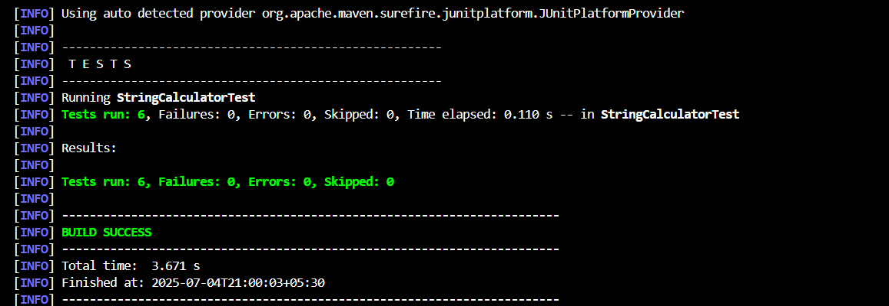
  

# 2.Allow the add method to handle any amount of numbers.
  
  

# 3.Allow the add method to handle new lines between numbers (instead of commas). ("1\n2,3" should return 6)
  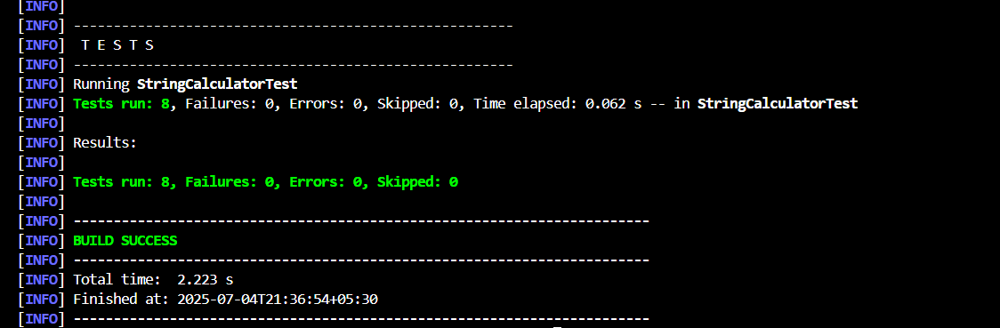
  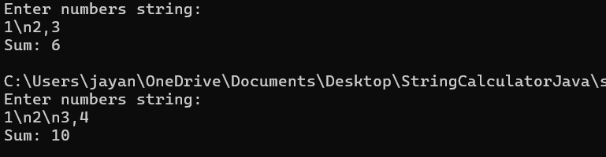

# 4.Support different delimiters: To change the delimiter, the beginning of the string will contain a separate line that looks like this: "//[delimiter]\n[numbers…]". For example, "//;\n1;2" where the delimiter is ";" should return 3.
  
  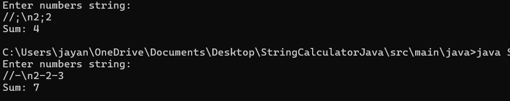

# 5.Calling add with a negative number will throw an exception: "negative numbers not allowed <negative_number>".If there are multiple negative numbers, show all of them in the exception message, separated by commas.
  
  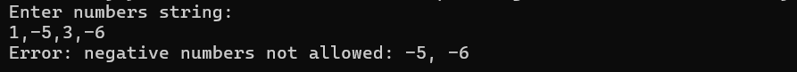

# 6.Numbers bigger than 1000 should be ignored, so adding 2 + 1001 = 2
  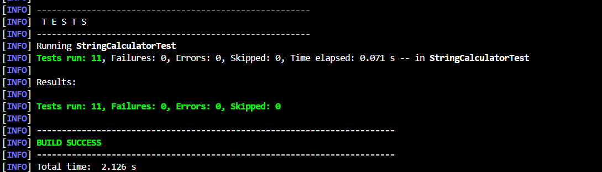
  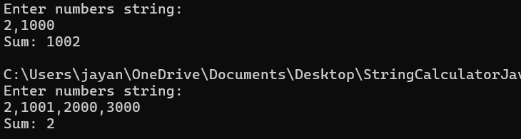

# 7.Delimiters can be of any length with the following format: “//[delimiter]\n” for example: “//[***]\n1***2***3” should return 6
  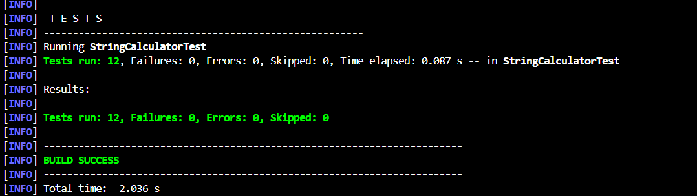
  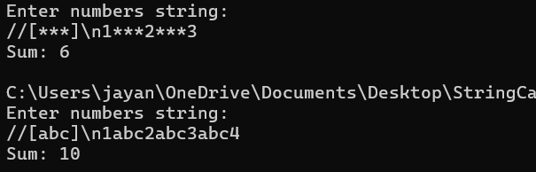

# 8.Allow multiple delimiters like this: “//[delim1][delim2]\n” for example “//[*][%]\n1*2%3” should return 6.
  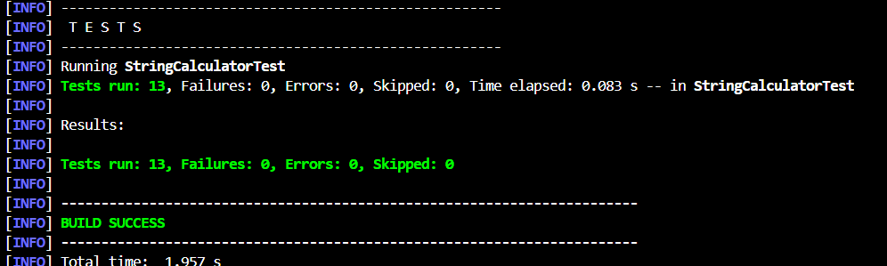

# 9.make sure you can also handle multiple delimiters with length longer than one char
  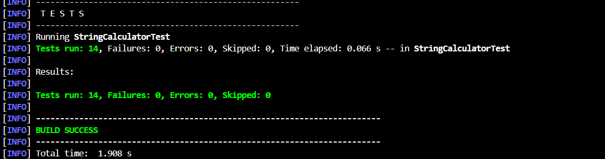

